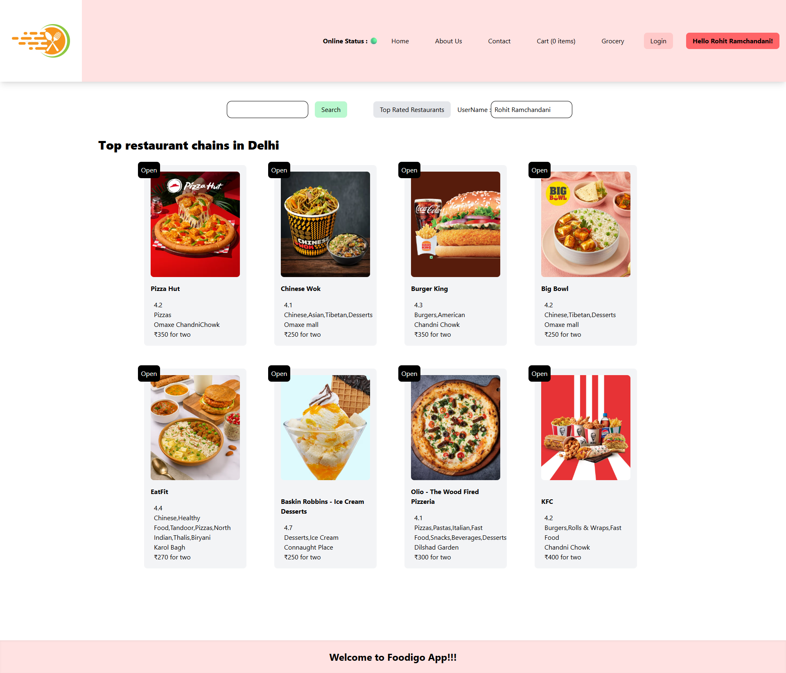
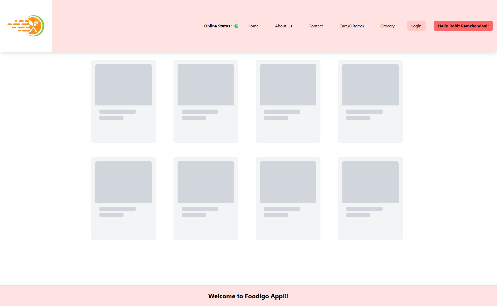
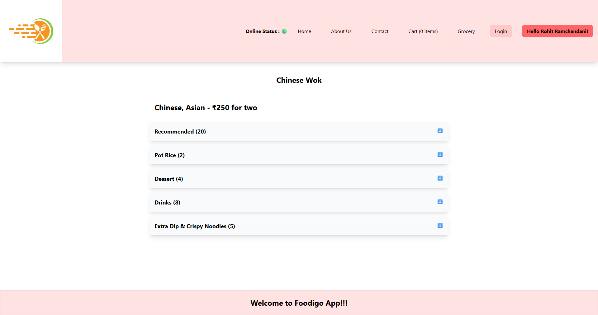
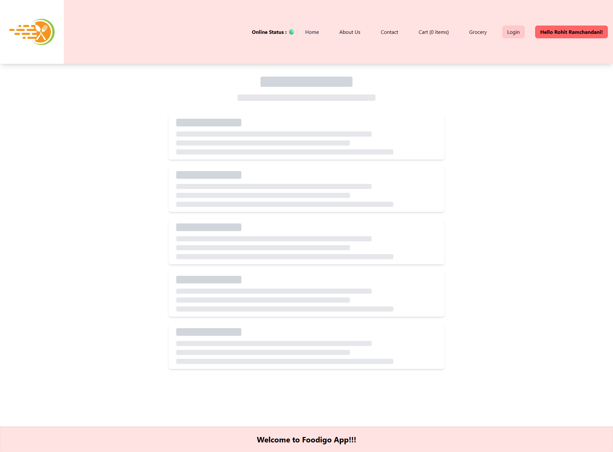
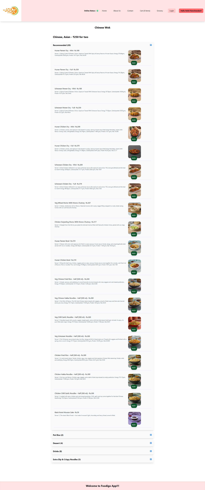
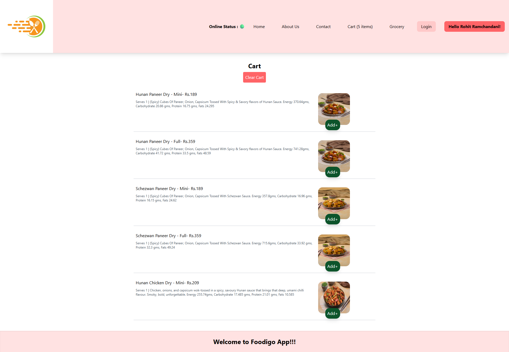
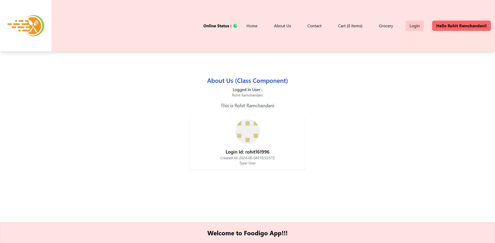
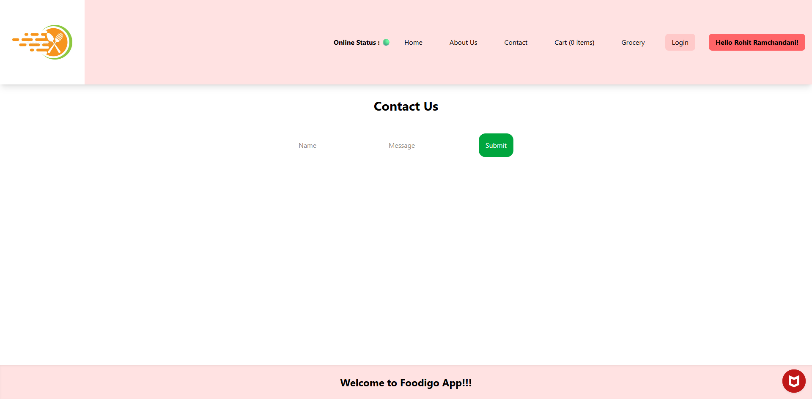
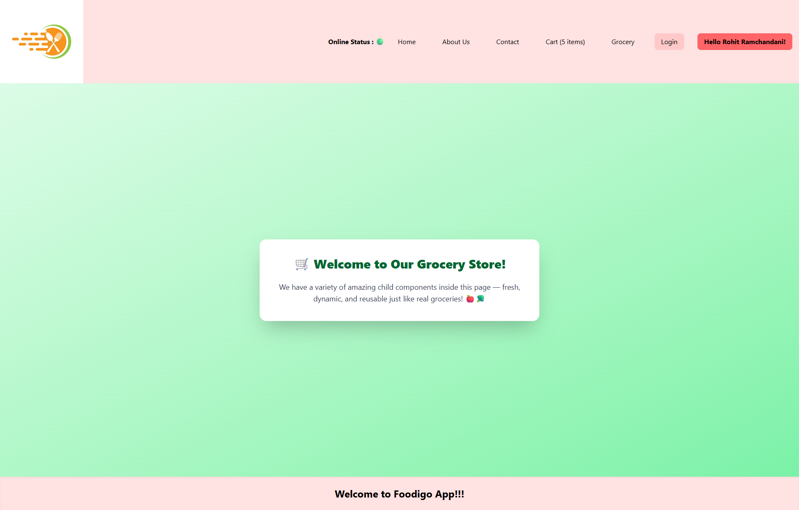

# 🍔 **Foodingo App – ReactJS**

> A modern food delivery UI inspired by Swiggy. Built using **ReactJS** with live Swiggy APIs, lazy loading, dynamic routing, and reusable components.

---

## 🚀 Features
- 🍽️ Dynamic restaurant & menu rendering
- 🛒 Cart functionality with Redux
- 💡 Shimmer UI placeholders while loading
- 🔁 Lazy-loaded Grocery page with Suspense
- 🧭 Client-side routing with React Router
- 🧑‍🤝‍🧑 User context using React Context API

---

## 📸 **App Screenshots**

---

### 🏠 1. Main Page  
Displays restaurant listings with header, search bar, and categories.

---

### 🔲 2. Main Page – Shimmer UI  
Shown while restaurants are being fetched.

---

### 🍽️ 3. Restaurant Menu Page  
Accordion-style menu with categories.

---

### 💡 4. Restaurant Menu – Shimmer UI  
Loading placeholder before menu is rendered.

---

### 📂 5. Restaurant Items – Category Open  
Category expanded showing menu items.

---

### 🛍️ 6. Cart Page  
Displays all items added to cart with quantity control.

---

### 👤 7. About Us Page  
Basic information about the application.

---

### 📞 8. Contact Us Page  
Shows a simple contact information section or form.

---

### 🥦 9. Grocery Page (Lazy Loaded)  
Demonstrates lazy loading using `React.lazy()` and `Suspense`.

